# ** 5.1 - Spark **

## ** BP 5.1.1  -  Use the most recent version of EMR **

Amazon EMR provides several Spark optimizations out of the box with [EMR Spark runtime](https://aws.amazon.com/blogs/big-data/run-apache-spark-3-0-workloads-1-7-times-faster-with-amazon-emr-runtime-for-apache-spark/) which is 100% compliant with the open source Spark API i.e., it does not require you to configure anything or change your application code. We continue to [improve](https://aws.amazon.com/about-aws/whats-new/2021/10/amazon-emr-6-4-supports-apache-spark-3-1-2/) the performance of this Spark runtime engine for new releases. Several [optimizations](https://docs.aws.amazon.com/emr/latest/ReleaseGuide/emr-spark-performance.html) such as Adaptive Query Execution are only available from 5.30 and 6.0 versions. For example, following is the Spark runtime performance improvement in EMR 6.5.0 (latest version as of writing this) compared to its previous version 6.1.0 based on a derived TPC-DS benchmark test performed on two identical EMR clusters with same hardware and software configurations (except for the version difference).


As seen in the above image, Spark runtime engine on EMR 6.5.0 is 1.9x faster by geometric mean compared to EMR 6.1.0. Hence, it is strongly recommended to migrate to the latest version of Amazon EMR or upgrade the existing version to make use of all these performance benefits.

## ** BP 5.1.2  -  Determine right infrastructure for your Spark workloads **

Spark workloads may require different types of hardware for different job characteristics to ensure optimal performance. EMR supports [several instance types](https://docs.aws.amazon.com/emr/latest/ManagementGuide/emr-supported-instance-types.html) to cover all types of processing requirements. While onboarding new workloads, start your benchmarking with general instance types like m5s or m6gs. Monitor the OS and YARN metrics from Ganglia and CloudWatch to determine the system bottlenecks at peak load. Bottlenecks include CPU, memory, storage and I/O. Once identified, choose the appropriate hardware type for your job’s needs.

* **Memory-optimized** instances like r5 and r4 are good candidates for memory intensive workloads. Spark jobs that cache large DataFrames, Datasets or RDDs, perform operations like joins and union on large tables, use a lot of internal or user-defined broadcast variables or accumulators, go through many GC cycles and perform massive shuffles (when dynamic allocation is disabled) are likely to be memory intensive. Following diagram shows YARN memory available percentage and aggregated OS memory utilization from Cloudwatch EMR namespace and Ganglia respectively.

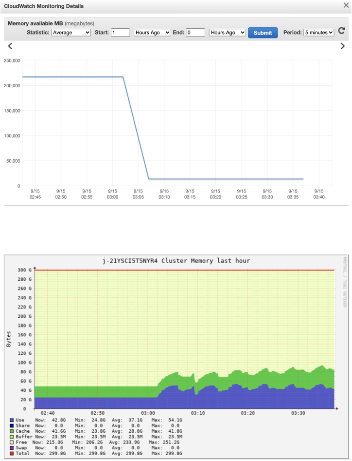

* **CPU-optimized** instances like c5 and c4 are good candidates for CPU intensive workloads . Spark jobs involving complex aggregate operations involving many in-built arithmetic functions or UDFs and jobs that use a lot of LRU caches are likely to be CPU intensive. Following screenshot shows aggregated CPU utilization of the EMR cluster from Ganglia.


* **General purpose** instances like m5 and m4 are good candidates for a mix of CPU and memory intensive workloads. They are also great for benchmarking and onboarding your Spark applications. Following sheet outlines the CPU:Memory ratio of of 3 example instances instances at a similar price.

| Instance Type | Instance | EC2 price | EMR price | Cores | Memory in GiB | CPU:memory ratio |
--------|----------------|------------|-----------|--------|------------|------------|
| Compute | m5.4xlarge |  $3.06 |  0.27 | 72 | 144 | 2 |
| Memory | m6g.4xlarge |  $3.02 |  0.27 | 48 | 384 | 8 |
| General | m5.16xlarge |  $3.07 |  0.27 | 64 | 256 | 4 |

* **Storage-optimized** instances like i3ens, d2 are good candidates for I/O intensive workloads. If your use case is CPU/memory bound but also consumes a lot of I/O, and demands high disk throughput and low read or write latencies from transient HDFS storage, you can consider using instances backed by SSD storage like r5ds, c5ds, m5ds etc.. For jobs that perform massive shuffles (when dynamic allocation is enabled), Spark external shuffle service will write the shuffle data blocks to the local disks of each node running executors.
* **GPU instances** such as p3 family for Spark ML and intensive analytical workloads like image processing. From EMR 6.2, you can also use [Nvidia RAPIDS accelerator](https://docs.aws.amazon.com/emr/latest/ReleaseGuide/emr-spark-rapids.html) plugin to improve your GPU instance performance without any changes to your code or data processing pipelines.

Starting EMR 5.31+ and 6.1+, there is Graviton support (r6g, m6g, c6g.) which offers up to 15% improvement in performance and 30% reduction in cost based on our derived benchmarks. They are a great choice to replace your legacy instances to observe improved performance at a lower cost.


## ** BP 5.1.3  -  Choose the right deploy mode **

Spark offers two kinds of deploy modes called client and cluster deploy modes. Deploy mode determines where your Spark driver runs. Spark driver is the cockpit for your application. It hosts the SparkContext (or SparkSession) for your application. It keeps track of all tasks executed by the executors and the state of the executors via heartbeats. Driver also fetches the results from the executors running tasks. Choose the right deploy mode based on your workload requirements.

### Client deploy mode

This is the default deploy mode for Spark applications in EMR. In this deploy mode, the driver process will be launched within your Spark client - whether you submit your job from EMR master node (using EMR step or spark-submit) or using a client external to EMR. Spark driver is a single point of failure. A failed driver JVM will not be relaunched in client deploy mode. Also, when client loses connectivity with YARN, your job will be killed.


Use this deploy mode if :-
* You are running only one or two Spark applications at a time in a cluster. This deploy mode is not ideal if you are running multiple applications at the same time on the same cluster since all those drivers running on a single node can lead to resource contention.
* You want to be more in control of your Spark driver configurations. In client mode, Spark driver resources will not compete with YARN resources and can be adjusted separately without affecting the resource procurement of your applications.
* If you are running too many executors (1000+). Since Spark driver manages and monitors tasks and executors, too many executors will slow down the driver since they have to send heartbeats, poll task status etc. Since EMR allows you to specify a different instance type for master instance, you can choose a very powerful instance like z1d and allocate the memory and CPU resources to Spark drivers especially if you are running a very high number of executors.
* If you want to print output to the console.

### Cluster deploy mode

In cluster deploy mode, your Spark driver will be colocated within the Application Master (AM) container from YARN regardless of where you submit your Spark application from.


Use cluster deploy mode if :-
* You are submitting multiple applications at the same time or have higher job or EMR step concurrency. Since drivers will be launched within the AM, for multiple applications, the driver resources will be spread across the cluster considering AM will be launched on one of the worker nodes.
* If there are relatively fewer number of executors per application. i.e., the Spark driver process does not have to do intensive operations like manage and monitor from too many executors.
* You are storing results in S3/HDFS and there is no need to print output to the console.
* You want to specify detailed instructions on where AM runs. You can launch AMs on CORE partition or both CORE and TASK partitions based on where you want your AM and executors to launch. For example, you can run AM on only on-demand CORE nodes and executors only on spot task nodes.
* If you want to relaunch a failed driver JVM. By default, YARN re-attempts AM loss twice based on property "spark.yarn.maxAppAttempts". You can increase this value further if needed.
* If you want to ensure that termination of your client will not terminate your application.
* If you want to return success from your client after job submission based on the property "spark.yarn.submit.waitAppCompletion".

Regardless of which deploy mode you choose, make sure that your driver Spark configs are tuned for your workload needs.

## ** BP 5.1.4  -  Use right file formats and compression type **

It is highly recommended that you use right file formats for optimal performance. Do not use legacy file formats like CSV, JSON, text files etc. since the read/write performance will much slower. It is highly recommended that you use columnar file formats like Parquet, ORC etc. Especially for Spark, Parquet would be the best choice.

When using Parquet file format, Spark will use EMRFSOutputCommitter which is an optimized file committer for writing Parquet data files to S3 from Spark. Also, using Parquet file format is great for schema evolution, filter push downs and integration with applications with transactional support like Apache Hudi, Iceberg etc.

Also, it’s recommended to use an optimal compression format. Avoid using unsplittable compression formats like GZIP. Since they are not splittable, when there is a large GZIP compressed file, it can only be processed by a single task/executor leading to OOM errors.


Use splittable compression formats like BZ2, LZO etc. Parquet uses Snappy compression by default. ORC uses ZLIB compression by default. Both compression types are good choices and you can continue to use defaults.


You can also apply columnar encryption using KMS.
```
sc.hadoopConfiguration.set("parquet.encryption.kms.client.class" ,"org.apache.parquet.crypto.keytools.mocks.InMemoryKMS")
// Explicit master keys (base64 encoded) - required only for mock InMemoryKMS
sc.hadoopConfiguration.set("parquet.encryption.key.list" ,"keyA:AAECAwQFBgcICQoLDA0ODw== ,  keyB:AAECAAECAAECAAECAAECAA==")
// Activate Parquet encryption, driven by Hadoop properties
sc.hadoopConfiguration.set("parquet.crypto.factory.class" ,"org.apache.parquet.crypto.keytools.PropertiesDrivenCryptoFactory")
// Write encrypted dataframe files.
// Column "square" will be protected with master key "keyA".
// Parquet file footers will be protected with master key "keyB"
squaresDF.write.option("parquet.encryption.column.keys" , "keyA:square").option("parquet.encryption.footer.key" , "keyB").parquet("/path/to/table.parquet.encrypted")
// Read encrypted dataframe files
val df2 = spark.read.parquet("/path/to/table.parquet.encrypted")
```

## ** BP 5.1.5  -  Partitioning **

Partitioning your data is very important if you are going to run your code or queries with filter conditions. Partitioning helps you arrange your data files into S3 prefixes based on the partition key. It helps minimize read/write access footprint i.e., you will be able to only read files from partition folder specified in your where clause - thus skipping a full read. Partitioning can also help if your data ingestion is incremental in nature. However, partitioning can reduce read throughput if you are performing full table scans.

You can choose your partition field based on :-

* Query pattern. i.e., if you find workloads use 1-2 columns frequently as filter fields more so than other columns, it is recommended to consider using them as partitioning field.
* Ingestion pattern. i.e., if you load data into your table once everyday, if you want to avoid re-writing historical data, you can partition your data based on date field (typically in YYYY-MM-DD format)
* Cardinality of the partitioning column. For partitioning, cardinality should not be too high.
* File sizes per partition. It is highly recommended that your individual file sizes within each partition is ~128 MB and not too small since that would be optimal for Spark executor JVM to process.

Also, number of shuffle partitions will determine the number of output files per partition.
```
df.repartition(400).write.partitionBy("datecol").parquet("s3://bucket/output/")
```
The above code will create maximum of 400 files per datecol partition. Repartition API alters number of shuffle partitions during runtime and partitionBy API determines the partition field(s). You can also control the number of shuffle partitions with the Spark property "spark.sql.shuffle.partitions". You can use repartition API to control the file size in destination. i.e., for merging smaller files. But for splitting large files, you can use the property "spark.sql.files.maxPartitionBytes".

Partitioning ensures that [dynamic partition pruning](https://docs.aws.amazon.com/emr/latest/ReleaseGuide/emr-spark-performance.html#emr-spark-performance-dynamic) takes place during reads and writes. Pruning makes sure that only necessary partition(s) are read from S3 or HDFS. Spark optimized logical plan or DAG can be studied to ensure that the partition filters are pushed down while reading and writing to partitioned tables from Spark.

For example, following query will push partition filters for faster retrieval. l_shipdate and l_shipmode are partition fields of the table "testdb.lineitem_shipmodesuppkey_part".

```
val df = spark.sql("select count(*) from testdb.lineitem_shipmodesuppkey_part where l_shipdate='1993-12-03' and l_shipmode='SHIP'")

df.queryExecution.toString
```
Printing query execution plan where we can see pushed filters for the two partition fields in where clause:

```
== Physical Plan ==
AdaptiveSparkPlan isFinalPlan=true
+- == Final Plan ==
   *(2) HashAggregate(keys=[], functions=[count(1)], output=[count(1)#320])
   +- ShuffleQueryStage 0
      +- Exchange SinglePartition, ENSURE_REQUIREMENTS, [id=#198]
         +- *(1) HashAggregate(keys=[], functions=[partial_count(1)], output=[count#318L])
            +- *(1) Project
               +- *(1) ColumnarToRow
                  +- FileScan orc testdb.lineitem_shipmodesuppkey_part[l_shipdate#313,l_shipmode#314] Batched: true, DataFilters: [], Format: ORC, Location: InMemoryFileIndex[s3://vasveena-test-vanguard/bigtpcparq/lineitem_shipmodesuppkey_part/l_shipdate..., PartitionFilters: [isnotnull(l_shipdate#313), isnotnull(l_shipmode#314), (l_shipdate#313 = 1993-12-03), (l_shipmode..., PushedFilters: [], ReadSchema: struct<>
+- == Initial Plan ==
   HashAggregate(keys=[], functions=[count(1)], output=[count(1)#320])
   +- Exchange SinglePartition, ENSURE_REQUIREMENTS, [id=#179]
      +- HashAggregate(keys=[], functions=[partial_count(1)], output=[count#318L])
         +- Project
            +- FileScan orc testdb.lineitem_shipmodesuppkey_part[l_shipdate#313,l_shipmode#314] Batched: true, DataFilters: [], Format: ORC, Location: InMemoryFileIndex[s3://vasveena-test-vanguard/bigtpcparq/lineitem_shipmodesuppkey_part/l_shipdate..., PartitionFilters: [isnotnull(l_shipdate#313), isnotnull(l_shipmode#314), (l_shipdate#313 = 1993-12-03), (l_shipmode..., PushedFilters: [], ReadSchema: struct<>
```

## ** BP 5.1.6 -  Tune driver/executor memory, cores and spark.sql.shuffle.partitions to fully utilize cluster resources **

Amazon EMR configures Spark defaults during the cluster launch based on your cluster's infrastructure (number of instances and instance types). EMR configured defaults are generally sufficient for majority of the workloads. However, if it is not meeting your performance expectations, we recommend you to tune Spark driver/executor configurations and see if you can achieve a better performance. Following are the general recommendations.  

For a starting point, generally, its advisable to set spark.executor.cores to 4 or 5 and tune spark.executor.memory around this value. Also, when you calculate the spark.executor.memory, you need to account for the executor overhead which is set to 0.1875 by default (i.e., 18.75% of spark.executor.memory). For example, for a 2 worker node r4.8xlarge cluster, following will be the configurations.

Based on [Task Configurations](https://docs.aws.amazon.com/emr/latest/ReleaseGuide/emr-hadoop-task-config.html) r4.8xlarge node has YARN memory of 241664 MB (based on the value of yarn.nodemanager.resource.memory-mb). The instance has 32 vCores. If we set spark.executor.cores as 4, we can run 8 executors at a time. So, the configurations will be following.

spark.executor.cores = 4
spark.executor.memory + (spark.executor.memory * spark.yarn.executor.memoryOverheadFactor) = (241664 MB / 8) = 30208 MB
spark.executor.memory = 24544 MB (substituting default spark.yarn.executor.memoryOverheadFactor=0.1875)

If you have a cluster of 10 r4.8xlarge nodes, then totally, 80 executors can run with 24544 MB memory and 4 vCores each.

Please note that some jobs benefit from bigger executor JVMs (more cores assigned). Some jobs benefit from smaller but more number of executors. So, you can use the above formula to arrive at optimal values for your application. EMR Spark has a feature called [maximizeResourceAllocation](https://docs.aws.amazon.com/emr/latest/ReleaseGuide/emr-spark-configure.html#emr-spark-maximizeresourceallocation). Setting this property to true will lead to one fat JVM per node that uses all of the available cores in that instance. However, please note that this setting may not prove to be optimal all types of workloads. It is not recommended to set this property to true if your cluster is a shared cluster with multiple parallel applications or if your cluster has HBase.

After configuring the values, run a sample job and monitor the Resource Manager UI, ContainerPendingRatio and YARNMemoryAvailablePcnt Cloudwatch metrics to verify that the vCores and YARN memory are being fully utilized. [Spark JMX metrics](https://spark.apache.org/docs/latest/monitoring.html) provides JMX level visibility which is the best way to determine resource utilization.

While using instance fleets, it is generally advisable to request worker nodes with similar vCore:memory ratio (for eg: requesting r4, r5 and r6gs in the same fleet). However, in some cases, in order to ensure capacity, you may have to diversify the instance type families as well in your request (for eg: requesting c5s, m5s and r5s in same fleet). EMR will configure driver/executor memory based on minimum of master, core and task OS memory. Generally, in this case, it is best to use the default configurations. However, if needed, you can fine tune the driver and executor configurations based on above principles. But in that case, you will need to take YARN memory and vCores of all the different instance families into consideration.

To provide an example, lets say you have requested a cluster with a core fleet containing following instances: r5.4xlarge, r5.12xlarge, c5.4xlarge, c5.12xlarge, m5.4xlarge, m5.12xlarge. All the 4xlarge instances in this fleet have 16 vCores and 12xlarge instances have 48 vCores. But the OS/YARN memory are different.

| Instance | YARN memory in MB |
|----------------|------------|
| c5.4xlarge | 24576 |
| c5.12xlarge | 90112 |
| m5.4xlarge | 57344 |
| m5.12xlarge | 188416 |
| r5.4xlarge | 122880 |
| r5.12xlarge | 385024 |

Now, let us calculate executor memory after setting spark.executor.cores = 4 by starting with smallest YARN memory from the above table (c5.4xlarge) and dividing the YARN memory by spark.executor.cores to get the total container size -> 24576 / 4 = 6144.

spark.executor.memory = 6144 - (6144 * 0.1875) = 4992 MB

In default Spark implementation, with the above math, if you set 4992 MB as executor memory, then in r5.12xlarge, the resources will be under utilized even though you will not see the evidence of it from the Resource Manager UI. With the above configs, 77 executors can run in r5.12xlarge but there are only 48 vCores. So, even though 77 executors will have YARN resources allocated, they are only able to run 48 tasks at any given time which could be considered a wastage of JVMs.

In order to alleviate this issue, from EMR 5.32 and EMR 6.2, there is a feature called Heterogenous Executors which dynamically calculates executor sizes. It is defined by the property "spark.yarn.heterogeneousExecutors.enabled" and is set to "true" by default. Further, you will be able to control the maximum resources allocated to each executor with properties "spark.executor.maxMemory" and "spark.executor.maxCores". Minimum resources are calculated with "spark.executor.cores" and "spark.executor.memory". For uniform instance groups or for flexible fleets with instance types having similar vCore:memory ratio, you can try setting this property to false and see if you get better performance.

Similar to executors, driver memory and vCores can be calculated as well. The default memory overhead for driver container is 10% of driver memory. If you are using cluster deploy mode, then the driver resources will be allocated from one of the worker nodes. So, based on the driver memory/core configurations, it will take away some of the YARN resources that could be used for launching executors. If you are using client deploy mode and submitting jobs from EMR master node or a remote server, then driver resources are taken from the master node or remote server and will not affect the resources available for executor JVMs. The default driver memory (without maximizeResourceAllocation) is 2 GB. You can increase driver memory or cores for following conditions:

1. Your cluster size is very large and there are many executors (1000+) that need to send heartbeats to driver.
2. Your result size retrieved during actions such as printing output to console is very large. For this, you will also need to tune "spark.driver.maxResultSize".

You can use smaller driver memory (or use the default spark.driver.memory) if you are running multiple jobs in parallel.

Now, coming to "spark.sql.shuffle.partitions" for Dataframes and Datasets and "spark.default.parallelism" for RDDs, it is recommended to set this value to total number of vCores in your cluster or a multiple of that value. For example, a 10 core node r4.8xlarge cluster can accommodate 320 vCores in total. Hence, you can set shuffle partitions or parallelism to 320 or a multiple of 320 such that each vCore handles a Spark partition. It is not recommended to set this value too high or too low. Generally 1 or 2x the total number of vCores is optimal. Generally, each Spark shuffle partition should process ~128 MB of data. This can be determined by looking at the execution plan from the Spark UI.

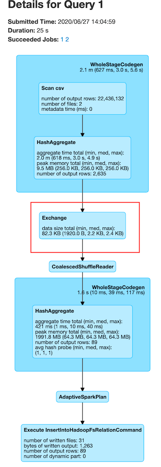

From the above screenshot, you can see average size in exchange is 2.2 KB which means we can try to reduce "spark.sql.shuffle.partitions" to increase partition size during exchange (or shuffle).

Apart from this, if you want to use a tooling for configuration suggestions, consider using [Sparklens and Dr. Elephant](https://aws.amazon.com/blogs/big-data/tune-hadoop-and-spark-performance-with-dr-elephant-and-sparklens-on-amazon-emr/) with Amazon EMR which will provide tuning suggestions based on metrics collected during your job run.

## ** BP 5.1.7 -  Use Kryo serializer by registering custom classes especially for Dataset schemas **

Spark uses Java Serializer by default. From Spark 2.0+, Spark internally uses Kryo Serializer when shuffling RDDs with simple types, arrays of simple types, or string type. It is highly recommended that you use Kryo Serializer and also register your classes in the application.
```
val spark = SparkSession
                  .builder
                  .appName("my spark application name")
                  .config(getConfig)
                  .config("spark.serializer", "org.apache.spark.serializer.KryoSerializer")
                  // use this if you need to increment Kryo buffer size. Default 64k
                  .config("spark.kryoserializer.buffer", "1024k")
                  // use this if you need to increment Kryo buffer max size. Default 64m
                  .config("spark.kryoserializer.buffer.max", "1024m")
                  /*
                  * Use this if you need to register all Kryo required classes.
                  * If it is false, you do not need register any class for Kryo, but it will increase your data size when the data is serializing.
                  */
                  .config("spark.kryo.registrationRequired", "true")
                  .getOrCreate
```
If you do not specify classesToRegister, then there will be a Kryo conversion overhead which could impact performance. Hence, it is highly recommended to register classes in your application. Especially, if you are using Datasets, consider registering your Dataset schema classes along with classes used in Spark internally based on the data types and structures used in your program. An example provided below:
```
val conf = new SparkConf()
        conf.registerKryoClasses(
          Array(
            classOf[org.myPackage.FlightDataset],
            classOf[org.myPackage.BookingDataset],
            classOf[scala.collection.mutable.WrappedArray.ofRef[_]],
            classOf[org.apache.spark.sql.types.StructType],
            classOf[Array[org.apache.spark.sql.types.StructType]],
            classOf[org.apache.spark.sql.types.StructField],
            classOf[Array[org.apache.spark.sql.types.StructField]],
            Class.forName("org.apache.spark.sql.types.StringType$"),
            Class.forName("org.apache.spark.sql.types.LongType$"),
            Class.forName("org.apache.spark.sql.types.BooleanType$"),
            Class.forName("org.apache.spark.sql.types.DoubleType$"),
            classOf[org.apache.spark.sql.types.Metadata],
            classOf[org.apache.spark.sql.types.ArrayType],
            Class.forName("org.apache.spark.sql.execution.joins.UnsafeHashedRelation"),
            classOf[org.apache.spark.sql.catalyst.InternalRow],
            classOf[Array[org.apache.spark.sql.catalyst.InternalRow]],
            classOf[org.apache.spark.sql.catalyst.expressions.UnsafeRow],
            Class.forName("org.apache.spark.sql.execution.joins.LongHashedRelation"),
            Class.forName("org.apache.spark.sql.execution.joins.LongToUnsafeRowMap"),
            classOf[org.apache.spark.util.collection.BitSet],
            classOf[org.apache.spark.sql.types.DataType],
            classOf[Array[org.apache.spark.sql.types.DataType]],
            Class.forName("org.apache.spark.sql.types.NullType$"),
            Class.forName("org.apache.spark.sql.types.IntegerType$"),
            Class.forName("org.apache.spark.sql.types.TimestampType$"),
            Class.forName("org.apache.spark.sql.execution.datasources.FileFormatWriter$WriteTaskResult"),
            Class.forName("org.apache.spark.internal.io.FileCommitProtocol$TaskCommitMessage"),
            Class.forName("scala.collection.immutable.Set$EmptySet$"),
            Class.forName("scala.reflect.ClassTag$$anon$1"),
            Class.forName("java.lang.Class")
          )
        )
    }
```
You can also fine tune the following Kryo configs :-

**spark.kryo.unsafe** - Set to false for faster serialization. This is not unsafer for same platforms but should not be used if your EMR cluster has a mix of AMD and intel types for example.
**spark.kryoserializer.buffer.max** - Maximum size of Kryo buffer. Default is 64m. Recommended to increase but this property upto 1024m value should be below 2048m
**spark.kryoserializer.buffer** - Initial size of Kryo's serialization buffer. Default is 64k. Recommended to increase up to 1024k.

## ** BP 5.1.8  -   Use appropriate garbage collector **

By default, EMR Spark uses Parallel Garbage Collector which works well in most cases. You can change the GC to G1GC if your GC cycles are slow since G1GC may provide better performance in some cases specifically by reducing GC pause times. Also, since G1GC is the default garbage collector since Java 9, you may want to switch to G1GC for forward compatibility.

Following is the spark configuration :-
```
[{
"classification": "spark-defaults",
"properties": {
    "spark.executor.extraJavaOptions": "-XX:+UseG1GC -XX:+UnlockDiagnosticVMOptions -XX:+G1SummarizeConcMark -XX:InitiatingHeapOccupancyPercent=35 -verbose:gc -XX:+PrintGCDetails -XX:+PrintGCDateStamps -XX:OnOutOfMemoryError='kill -9 %p'",
    "spark.driver.extraJavaOptions": "-XX:+UseG1GC -XX:+UnlockDiagnosticVMOptions -XX:+G1SummarizeConcMark -XX:InitiatingHeapOccupancyPercent=35 -verbose:gc -XX:+PrintGCDetails -XX:+PrintGCDateStamps -XX:OnOutOfMemoryError='kill -9 %p'"
},
"configurations": []
}]
```
You can also tune the GC parameters for GC performance. You can see the comprehensive list of parameters [here](https://www.oracle.com/technical-resources/articles/java/g1gc.html) for G1GC and [here](https://docs.oracle.com/en/java/javase/11/gctuning/parallel-collector1.html) for ParallelGC. Some useful ones are below :-

-XX:ConcGCThreads=n
-XX:ParallelGCThreads=n
-XX:InitiatingHeapOccupancyPercent=45
-XX:MaxGCPauseMillis=200

You can also monitor GC performance using Spark UI. the GC time should be ideally <= 1% of total task runtime. If not, tune the GC settings or executor size. For example, we see below in the Spark UI that GC takes almost 25% of task runtime which is a poor GC performance.

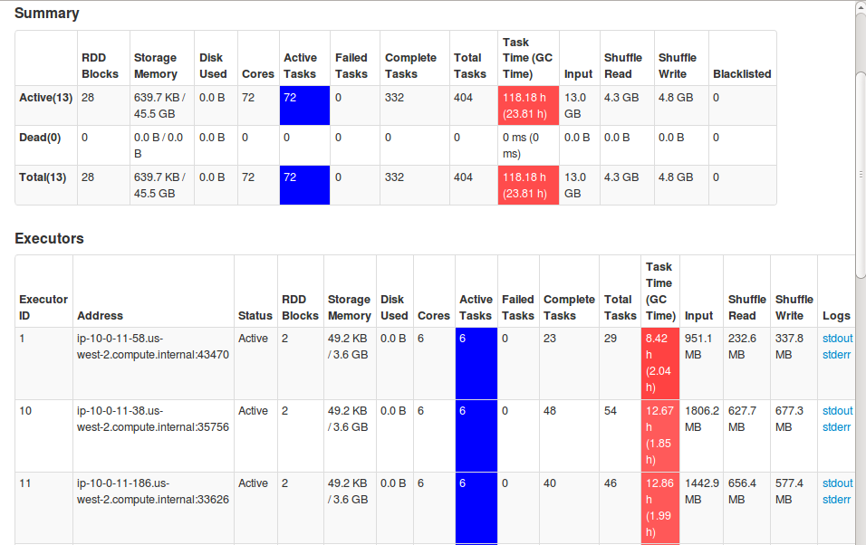

## ** BP 5.1.9  -   Use appropriate APIs wherever possible **

When using spark APIs, try to go with the most optimal choice if your use case permits. Following are a few examples.

### repartition vs coalesce

Both repartition and coalesce are used for changing the number of shuffle partitions. Repartition is used for both increasing and decreasing the shuffle partitions whereas coalesce is used for only decreasing the number of shuffle partitions. If your goal is to decrease the number of shuffle partitions, consider using coalesce instead of repartition. The reason is, repartition triggers a full shuffle but coalesce triggers only a partial shuffle and thus minimizes the amount of data shuffled by keeping a few nodes as receivers of shuffle data.
```
df.coalesce(1) //instead of df.repartition(1)
```
But please note that when you coalesce (or repartition) to a very small number, your JVM will process a lot of data which can lead to OOM issues or disk space issues due to shuffle spill.

### groupByKey vs reduceByKey

Use reduceByKey instead of groupByKey wherever possible. With groupByKey, data will be transferred over the network and collected on the reduced workers. This can lead to OOMs since all data is sent across the network. Whereas, with reduceByKey, data is combined at partition-level, with only one output for one key at each partition to send over the network. reduceByKey required combining all your values into another value with the exact same type.

### orderBy vs sortBy or sortWithinPartitions

orderBy does global sorting. i.e., all data is sorted in a single JVM. Whereas, sortBy or sortWithinPartitions does local sorting i.e., data is sorted within each partition but it does not preserve global ordering. Use sortBy or sortWithinPartitions if global sorting is not necessary - especially during writes. Try to avoid orderBy clause. Values can be aggregated across partitions in your queries if needed.

## ** BP 5.1.10 -   Leverage spot nodes with managed autoscaling **

Enable managed autoscaling for your EMR clusters. From EMR 5.32 and EMR 6.2 there have been optimizations made to managed scaling to make it more resilient for your Spark workloads. It is not recommended to use Spot with core or master nodes since during reclaimation event, your cluster could be terminated and you would need to re-process all the work. Try to leverage task instance fleets with many instance types per fleet with Spot since it would give both cost and performance gains. However, in this case, make sure that your output is being written directly to EMRFS since we will have fixed core node on-demand capacity.

Following policy defines max core nodes to 2 and we are requesting the core nodes to be on-demand as recommended. Rest of the nodes are Spot task nodes.

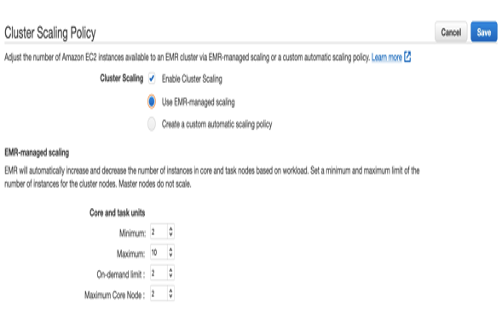

Following experimentation illustrates the performance gains using Managed Autoscaling.


For Spark workloads, we observed ~50% gains compared to custom autoscaling clusters.


Please note that the results may vary based on your workloads. Also, if your workloads are SLA sensitive and fault intolerant, it is best to use on-demand nodes for task fleets as well since reclaimation of Spot may lead to re-computation of one or many stages or tasks.

## ** BP 5.1.11  -   For workloads with predictable pattern, consider disabling dynamic allocation **

Dynamic allocation is enabled in EMR by default. It is a great feature for following types of workloads:

1. Workloads processing variable amount of data  
2. When your cluster uses autoscaling
3. Dynamic processing requirements or unpredictable workload patterns
4. Streaming and ad-hoc workloads
5. When your cluster runs multiple applications
6. Your cluster is long-running

The above would cover at least 95% of the workloads run by our customers today. However, there are a very few cases where:

1. Workloads have a very predicatable pattern
2. Amount of data processed is predictable and consistent throughout the application
3. Cluster runs Spark application in batch mode
4. Clusters are transient and are of fixed size (no autoscaling)
5. Application processing is relatively uniform. Workload is not spikey in nature.

For example, you may have a use case where you are collecting weather information of certain geo regions twice a day. In this case, your data load will be predictable and you will run two batch jobs per day - one at BOD and one at EOD. Also, you may use two transient clusters to process these two jobs.  

For such use cases, you can consider disabling dynamic allocation along with setting the precise  number and size of executors and vCores like below.

```
[{
    "classification": "spark-defaults",
    "properties": {
        "spark.dynamicAllocation.enabled": "false",
        "spark.executor.instances": "12",
        "spark.executor.memory": "8G",
        "spark.executor.cores": "4"
    },
    "configurations": []
}]
```
Please note that if you are running more than one application at a time, you may need to tweak the configurations to allocate resources to them. By disabling dynamic allocation, Spark driver or YARN Application Master does not have to calculate resource requirements at runtime or collect certain heuristics. This may save anywhere from 5-10% of job execution time. However, you will need to carefully plan Spark executor configurations in order to ensure that your entire cluster is being utilized. If you choose to do this, then it is better to disable autoscaling since your cluster only runs a fixed number of executors at any given time unless your cluster runs other applications as well.

However, only consider this option if your workloads meet all the above criteria since otherwise your jobs may fail due to lack of resources or you may end up wasting your cluster resources.

## ** BP 5.1.12  -   Leverage HDFS as temporary storage for I/O intensive workloads **

Many EMR users directly read and write data in S3. This is generally suited for most type of use cases. However, for I/O intensive workflows, this approach could be slower - especially for heavy writes.


For very I/O intensive workloads or for workloads where the temporary transform data is much larger than the final output, you can leverage HDFS as temporary storage and then use S3DistCp to copy the data into final location. For example, for a fraud detection use case where you could be performing transforms on TBs of data but your final output report is only a few KBs, in such scenarios, leveraging HDFS will give you better performance and also helps you avoid S3 throttling.


Following is a typical application of HDFS for transient storage. A Spark context could be shared between multiple workflows, wherein, each workflow comprising of multiple transformations. After all transformations are complete, each workflow would write the output to HDFS location. Once all transforms are complete, you can save the final output to S3 either using S3DistCp or SDK determined by the number of files and output size.


However,  while using this architecture, please make sure that you are sizing your HDFS properly to prevent job failures due to lack of storage space when the job is running. Refer to best practice BP 2.13 in Reliability section.

Even if you are using S3 directly to store your data, if your workloads are shuffle intensive, use storage optimized instances or SSD/NVMe based storage (for example: r5d’s and r6gd’s instead of r5s and r6g’s). This is because dynamic allocation will use Spark external shuffle service that spills data to local disks when the executor JVM cannot hold any more shuffle data. This process is a very I/O intensive one and will benefit from instance types that offer high disk throughput.

## ** BP 5.1.13  -   Spark speculation with EMRFS **

In Hadoop/Spark, speculative execution is a concept where a slower task will be launched in parallel on another node using a different JVM (based on resource availability). Whichever task completes first (original or speculated task), will write the output to S3. This works well for HDFS based writes. However, for EMRFS, turning on spark.speculation may lead to data loss or duplicate data. By default, “spark.speculation” is turned off. Only enable spark.speculation if you are doing one of the following.

* Writing Parquet files to S3 using EMRFSOutputCommitter
* Using HDFS as temporary storage (in an understanding that final output will be written to S3 using S3DistCp)
* Using HDFS as storage

**Do not enable spark.speculation if none of the above criteria is met since it will lead to incorrect or missing or duplicate data in your destination.**

You can consider enabling spark.speculation especially while running workloads on very large clusters, provided you are performing one of the above actions. Reason is that, due to some hardware issues, one node out of 500+ nodes could be slower and may run tasks slowly even if data size being processed is the same as other tasks. Chances of this happening are higher in larger clusters. In that case, spark.speculation will help relaunch those slow tasks on other nodes providing SLA consistency (as long as the above criteria are met).

You can set spark.speculation to true in spark-defaults or pass it as a command line option (--conf spark.speculation="true").

```
[{
    "classification": "spark-defaults",
    "properties": {
        "spark.speculation": "true"
    },
    "configurations": []
}]
```

Please do not enable spark.speculation if you are writing any non-Parquet files to S3 or if you are writing Parquet files to S3 without the default EMRFSOutputCommitter.

## ** BP 5.1.14 -   Data quality and integrity checks with deequ **

Spark and Hadoop frameworks do not inherently guarantee data integrity. While it is very rare, you may observe some data corruption or missing data or duplicate data due to unexpected errors in the hardware and software stack. It is highly recommended that you validate the integrity and quality of your data atleast once after your job execution. It would be best to check data correctness in multiple stages of your job - especially if your job is long-running.

In order to check your data integrity, consider using [Deequ](https://github.com/awslabs/deequ) for your Spark workloads. Following are the blogs that can help you get started with Deequ for Spark workloads.

[Test data quality at scale with Deequ | AWS Big Data Blog](https://aws.amazon.com/blogs/big-data/test-data-quality-at-scale-with-deequ/)

[Testing data quality at scale with PyDeequ | AWS Big Data Blog](https://aws.amazon.com/blogs/big-data/testing-data-quality-at-scale-with-pydeequ/)

Sometimes, you may have to write your own validation logic. For example, if you are doing a lot of calculations or aggregations, you will need to compute twice and compare the two results for accuracy. In other cases, you may also implement checksum on data computed and compare it with the checksum on data written to disk or S3. If you see unexpected results, then check your Spark UI and see if you are getting too many errors from a single node by sorting the Task list based on "Status" and checking for error message of failed tasks. If you are seeing too many random unexpected errors such as "ArrayIndexOutOfBounds" or checksum errors from a single node, then it may be possible that the node is impaired. Exclude or terminate this node and re-start your job.

## ** BP 5.1.15 -   Use DataFrames wherever possible **

WKT we must use Dataframes and Datasets instead of RDDs since both have several enhancements over RDDs like catalyst optimizer and adaptive query execution. But between Datasets and Dataframes Dataframes perform certain optimizations during DAG creation and execution. These optimizations can be identified by inspecting the query plan. For example -

* Datasets perform many serializations and deserializations that Dataframes do not perform.
* Dataframes perform better push downs. For example, if there is a filter operation, that is applied early on in the query plan so that the data transfer in-memory is reduced.
* Dataframes avoid unnecessary exchanges. For example, distinct after join will be accomplished with two exchanges in datasets but with only one exchange in DFs.

Only downside to using dataframes instead of datasets is that, with dataset, you generally define schema in class.

```
case class DeviceIoTData (
  battery_level: Long,
  c02_level: Long,
  cca2: String,
  cca3: String,
  cn: String,
  device_id: Long,
  device_name: String,
  humidity: Long,
  ip: String,
  latitude: Double,
  longitude: Double,
  scale: String,
  temp: Long,
  timestamp: Long
)
```
This provides you type-safety. When there are changes to your schema, it can be consolidated and tracked in a single class. This can be considered as an industry standard. While using Spark DDataframes, you can achieve something similar by maintaining the table columns in a list and fetching from that list dynamically in your code. But this requires some additional coding effort.

## ** BP 5.1.16  -   Data Skew **

Data skew can significantly slow down the processing since a single JVM could be handling a large amount of data. In this case observed in Spark UI, a single task is processing 25 times more data than other tasks. This can inevitably lead to slowness, OOMs and disk space filling issues.

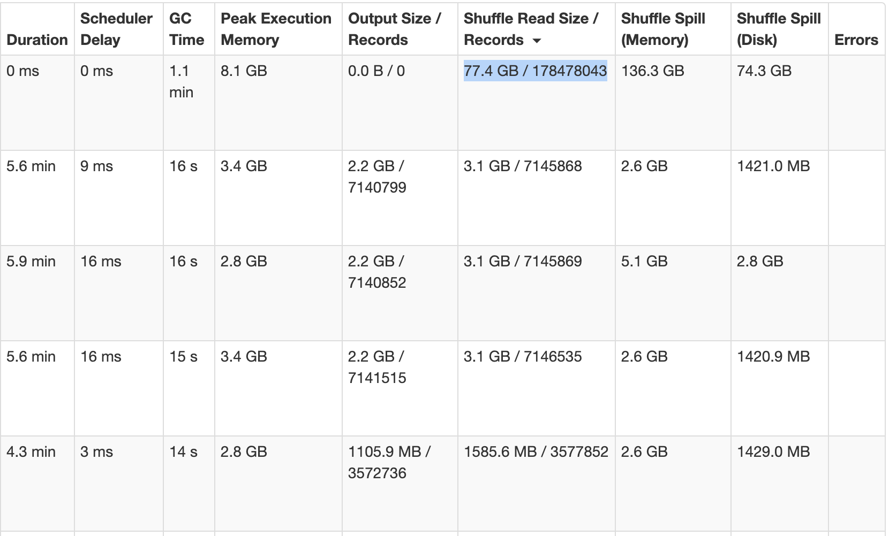

When there is a data skew, it is best handled at code level since very little can be done in terms of configuration. You can increase JVM size or use one fat executor per node in order to prevent OOMs to the best of ability. But this will impact other tasks and also will not improve your job performance since one task uses only one vCPU.

Following are some of the common strategies to mitigate data skew at code level.

### Salting
Salting is one of the most common skew mitigation technique where you add a "salt" to the column say "col1" that is skewed. You can split it into multiple columns like "col1_0","col1_1","col1_2" and so on. As number of salts increase, the skew decreases i.e., more parallelism of tasks can be achieved.

**Original data**

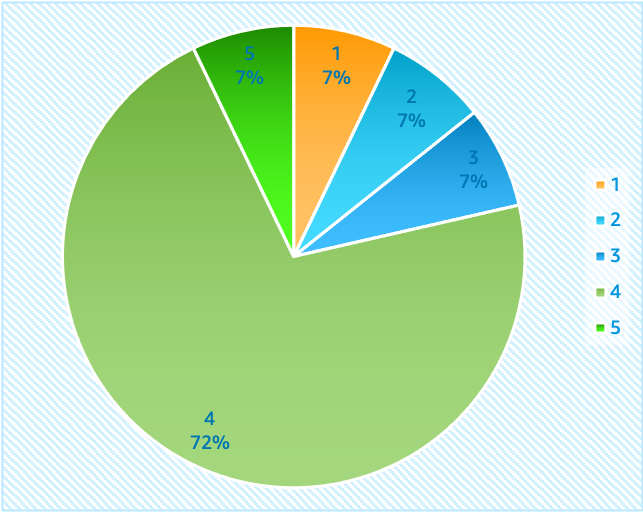

**Salted 4  times**

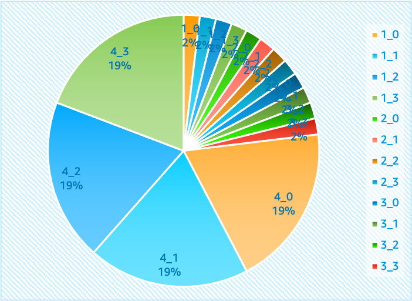

**Salted 8 times**


A typical Salting workflow looks like below:


For example, a salt column is added to the data with 100 randomized salts during narrow transformation phase (map or flatMap type of transforms).

```
n = 100
salted_df = df.withColumn("salt", (rand * n).cast(IntegerType))
```

Now, aggregation is performed on this salt column and the results are reduced by keys

```
unsalted_df = salted_df.groupBy("salt", groupByFields).agg(aggregateFields).groupBy(groupByFields).agg(aggregateFields)
```
Similar logic can  be applied for windowing functions as well.

A downside to this approach is that it creates too many small tasks for non-skewed keys as well which may have a negative impact on the performance.

### Isolated Salting
This is an approach where salting is applied to only subset of the keys. If 80% or more data belongs to one field, isolated salting approach could be considered (for eg: skew due to NULL columns). In narrow transformation phase, we will isolate the skewed column. In the wide transformation phase, we  will isolate and reduce the heavily skewed column after salting. Finally, we will reduce other values without the salt and merge the results.

Isolated Salting workflow looks like below:


An example code looks like below:

```
val count = 4
val salted = df.withColumn("salt", when('col === "A", rand(1) * count cast IntegerType) otherwise 0)
val replicaDF = skewDF
      .withColumn("replica", when('col === "A", (0 until count) toArray) otherwise Array(0))
      .withColumn("salt", explode('replica'))
      .drop('replica')
val merged = salted.join(replicaDF, joinColumns :+ "salt")
```
### Isolated broadcast join
In this approach, smaller lookup table is broadcasted across workers and joined in map phase itself. Thus, reducing the amount of data shuffles. Similar to last approach, skewed keys are separated from normal keys. Then, we reduce the ”normal” keys and perform map-side join on isolated ”skewed” keys. Finally, we can merge the results of skewed and normal joins

Isolated map-side join workflow looks like below:


An example code looks like below:

```
val count = 8
val salted = skewDF.withColumn("salt", when('col === "A", rand(1) * count cast IntegerType) otherwise 0).repartition('col', 'salt') // Re-partition to remove skew
val broadcastDF = salted.join(broadcast(sourceDF), "symbol")
```

### Hashing for SparkSQL queries
While running SparkSQL queries, you may have seen that it runs out of memory sometimes due to skew. Especially, this could be seen for windowing queries with a skew.

Following could be an example query with a skew.

```
select *, ROW_NUMBER() OVER (partition by l_orderkey order by l_orderkey) AS row_num FROM testdb.skewlineitem
```
Considering there is a skew in l_orderkey field, we can split the above query into 4 hashes.
```
select * from (select *, ROW_NUMBER() OVER (partition by l_orderkey order by l_orderkey) AS row_num FROM testdb.skewlineitem where cast(l_orderkey as integer)%4 = 1
union
select *, ROW_NUMBER() OVER (partition by l_orderkey order by l_orderkey ) AS row_num FROM testdb.skewlineitem where cast(l_orderkey as integer)%4 = 2
union
select *, ROW_NUMBER() OVER (partition by l_orderkey order by l_orderkey ) AS row_num FROM testdb.skewlineitem where cast(l_orderkey as integer)%4 = 3
union
select *, ROW_NUMBER() OVER (partition by l_orderkey order by l_orderkey ) AS row_num FROM testdb.skewlineitem where cast(l_orderkey as integer)%4 = 4 )
limit 10;
```
If the values are highly skewed, then salting approaches should be used instead since this approach will still send all the skewed keys to a single task. This approach should be used to prevent OOMs quickly rather than to increase performance. The read job is re-computed for the number of sub queries written.

## ** BP 5.1.17  -  Choose the right type of join **

There are several types of joins in Spark. Some are more optimal than others based on certain considerations. Spark by default does a few join optimizations. However, we can pass join "hints" as well if needed to instruct Spark to use our preferred type of join. For example, in the following SparkSQL queries we supply broadcast and shuffle join hints respectively.

```
SELECT /*+ BROADCAST(t1) */ * FROM t1 INNER JOIN t2 ON t1.key = t2.key;
SELECT /*+ SHUFFLE_HASH(t1) */ * FROM t1 INNER JOIN t2 ON t1.key = t2.key;
```

### Broadcast Join
Broadcast join i.e., map-side join is the most optimal join provided one of your tables is small enough - in the order of MBs and you are performing an equi (=) join. All join types are supported except full outer joins. This join type broadcasts the smaller table as a hash table across all the worker nodes in memory. Note that once the small table has been broadcasted, we cannot make changes to it. Now that the hash table is locally in the JVM, it is merged easily with the large table based on the condition using a hash join. High performance while using this join can be attributed to minimal shuffle overhead. From EMR 5.30 and EMR 6.x onwards, by default, while performing a join if one of your tables is <=10 MB, this join strategy is chosen. This is based on the parameter *spark.sql.autoBroadcastJoinThreshold* which is defaulted to 10 MB.

If one of your join tables are larger than 10 MB, you can either modify *spark.sql.autoBroadcastJoinThreshold* or use an explicit broadcast hint. You can verify that your query uses a broadcast join by investigating the live plan from SQL tab of Spark UI.


Please note that you should not use this join if your "small" table is not small enough. For eg, when you are joining a 10 GB table with a 10 TB table, your smaller table may still be large enough to not fit into the executor memory and will subsequently lead to OOMs and other type of failures. Also, it is not recommended to pass GBs of data over network to all of the workers which will cause serious network bottlenecks. Only use this join if your table size is <1 GB.

### Sort Merge Join
This is the most common join used by Spark. If you are joining two large tables (>10 MB by default), your join keys are sortable and your join condition is equi (=), it is highly likely that Spark uses a Sort Merge join which can be verified by looking into the live plan from the Spark UI.

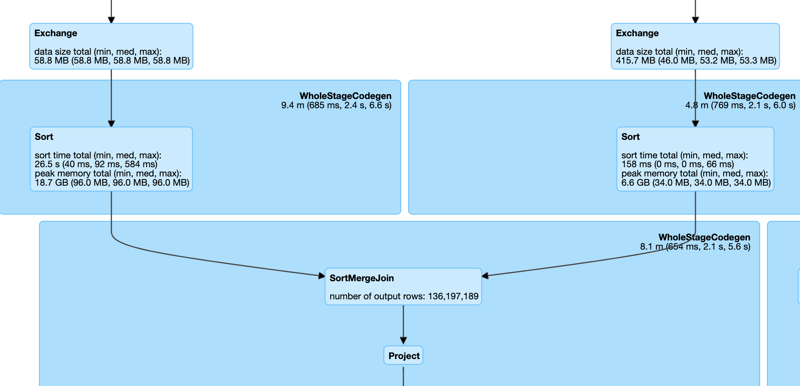

Spark configuration *spark.sql.join.preferSortMergeJoin* is defaulted to true from Spark 2.3 onwards. When this join is implemented, data is read from both tables and shuffled. After this shuffle operation, records with the same keys from both datasets are sent to the same partition. Here, the entire dataset is not broadcasted, which means that the data in each partition will be of manageable size after the shuffle operation. After this, records on both sides are sorted by the join key. A join is performed by iterating over the records on the sorted dataset. Since the dataset is sorted the merge or the join operation is stopped for an element as soon as a key mismatch is encountered. So a join attempt is not performed on all keys. After sorting, join operation is performed upon iterating the datasets on both sides which will happen quickly on the sorted datasets.

Continue to use this join type if you are joining two large tables with an equi condition on sortable keys. Do not convert a sort merge join to broadcast unless one of the tables is < 1 GB. All join types are supported.

### Shuffle Hash Join
Shuffle Hash Join sends data with the same join keys in the same executor node followed by a Hash Join. The data is shuffled among the executors using the join key. Then, the data is combined using Hash Join since data from the same key will be present in the same executor. In most cases, this join type performs poorly when compared to Sort Merge join since it is more shuffle intensive. Typically, this join type is avoided by Spark unless *spark.sql.join.preferSortMergeJoin* is set to false or the join keys are not sortable. This join also supports only equi conditions. All join types are supported except full outer joins. If you find out from the Spark UI that you are using a Shuffle Hash join, then check your join condition and see if you are using non-sortable keys and cast them into a sortable type to convert it into a Sort Merge join.

### Broadcast Nested Loop Join
Broadcast Nested Loop Join broadcasts one of the entire datasets and performs a nested loop to join the data. Some of the results are broadcasted for a better performance. Broadcast Nested Loop Join generally leads to your job performance being negatively impacted and may lead to OOMs or network bottlenecks. This join type is avoided by Spark unless no other options are applicable. This join type supports both equi and non-equi joins (<,>,<=,>=,like conditions,array/list matching etc.). If you see this join being used by Spark upon investigating your query plan, it is possible that it is being caused by a poor coding practice.

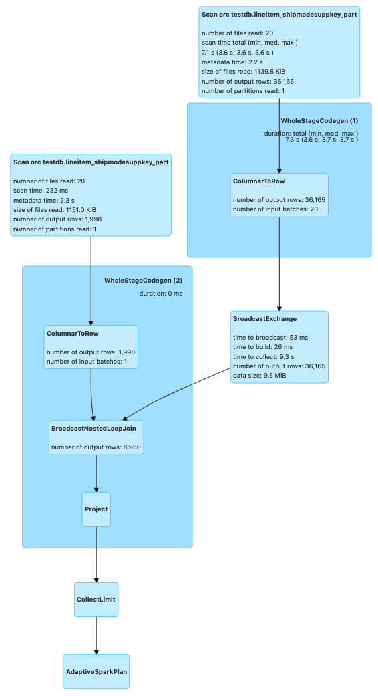

Best way to eliminate this join is to see if you can change your code to use equi condition instead. For example, if you are joining two tables by matching elements from two arrays, explode the arrays first and do an equi join. However, there are some cases where this join is not avoidable.

For example, below code leads to Broadcast Nested Loop Join.

```
val df1 = spark.sql("select * from testdb.lineitem_shipmodesuppkey_part where l_shipdate='1993-12-03' and l_shipmode='SHIP'")
val df2 = spark.sql("select * from testdb.lineitem_shipmodesuppkey_part where l_shipdate='1993-12-04' and l_shipmode='SHIP'")
val nestedLoopDF = df1.join(df2, df1("l_partkey") === df2("l_partkey") || df1("l_linenumber") === df2("l_linenumber"))
```
Instead, you can change the code like below:

```
val result1 = df1.join(df2, df1("l_partkey") === df2("l_partkey"))
val result2 = df1.join(df2, df1("l_linenumber") === df2("l_linenumber"))
val resultDF = result1.union(result2)
```
The query plan after optimization looks like below. You can also optionally pass a broadcast hint to ensure that broadcast join happens if any one of your two tables is small enough. In the following case, it picked broadcast join by default since one of the two tables met *spark.sql.autoBroadcastJoinThreshold*.


### Cartesian Join
Cartesian joins or cross joins are typically the worst type of joins. It is chosen if you are running "inner like" queries. This type of join follows the below procedure which as you can see is very inefficient and may lead to OOMs and network bottlenecks.

```
for l_key in lhs_table:
  for r_key in rhs_table:
    #Execute join condition
```
If this join type cannot be avoided, consider passing a Broadcast hint on one of the tables if it is small enough which will lead to Spark picking Broadcast Nested Loop Join instead. Broadcast Nested Loop Join may be slightly better than the cartesian joins in some cases since atleast some of the results are broadcasted for better performance.

Following code will lead to a Cartesian product provided the tables do not meet *spark.sql.autoBroadcastJoinThreshold*.

```
val crossJoinDF = df1.join(df2, df1("l_partkey") >= df2("l_partkey"))
```
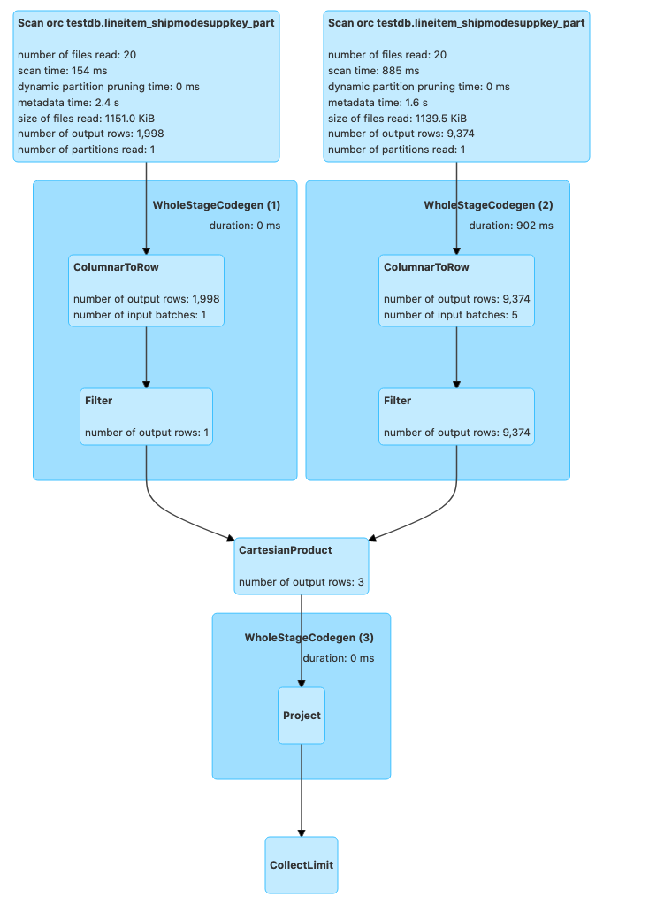

Now, passing a broadcast hint which leads to Broadcast Nested Loop Join

```
val crossJoinDF = df1.join(broadcast(df2), df1("l_partkey") >= df2("l_partkey"))
```


## ** BP 5.1.18  - Consider Spark Blacklisting for large clusters **

Spark provides blacklisting feature which allows you to blacklist an executor or even an entire node if one or more tasks fail on the same node or executor for more than configured number of times. Spark blacklisting properties may prove to be very useful especially for very large clusters (100+ nodes) where you may rarely encounter an impaired node. We discussed this issue briefly in BPs 5.1.13 and 5.1.14.

This blacklisting is enabled by default in Amazon EMR with the *spark.blacklist.decommissioning.enabled* property set to true. You can control the time for which the node is blacklisted using *spark.blacklist.decommissioning.timeout property*, which is set to 1 hour by default, equal to the default value for *yarn.resourcemanager.nodemanager-graceful-decommission-timeout-secs*. It is recommended to set *spark.blacklist.decommissioning.timeout* to a value equal to or greater than *yarn.resourcemanager.nodemanager-graceful-decommission-timeout-secs* to make sure that Amazon EMR blacklists the node for the entire decommissioning period.

Following are some *experimental* blacklisting properties.

**spark.blacklist.task.maxTaskAttemptsPerExecutor** determines the number of times a unit task can be retried on one executor before it is blacklisted for that task. Defaults to 2.

**spark.blacklist.task.maxTaskAttemptsPerNode** determines the number of times a unit task can be retried on one worker node before the entire node is blacklisted for that task. Defaults to 2.

**spark.blacklist.stage.maxFailedTasksPerExecutor** is same as *spark.blacklist.task.maxTaskAttemptsPerExecutor* but the executor is blacklisted for the entire stage.

**spark.blacklist.stage.maxFailedExecutorsPerNode** determines how many different executors are marked as blacklisted for a given stage, before the entire worker node is marked as blacklisted for the stage. Defaults to 2.

**spark.blacklist.application.maxFailedTasksPerExecutor** is same as *spark.blacklist.task.maxTaskAttemptsPerExecutor* but the executor is blacklisted for the entire application.

**spark.blacklist.application.maxFailedExecutorsPerNode** is same as *spark.blacklist.stage.maxFailedExecutorsPerNode* but the worker node is blacklisted for the entire application.

**spark.blacklist.killBlacklistedExecutors** when set to true will kill the executors when they are blacklisted for the entire application or during a fetch failure. If node blacklisting properties are used, it will kill all the executors of a blacklisted node. It defaults to false. Use with caution since it is susceptible to unexpected behavior due to red herring.

**spark.blacklist.application.fetchFailure.enabled** when set to true will blacklist the executor immediately when a fetch failure happens. If external shuffle service is enabled, then the whole node will be blacklisted. This setting is aggressive. Fetch failures usually happen due to a rare occurrence of impaired hardware but may happen due to other reasons as well. Use with caution since it is susceptible to unexpected behavior due to red herring.

The node blacklisting configurations are helpful for the rarely impaired hardware case we discussed earlier. For example, following configurations can be set to ensure that if a task fails more than 2 times in an executor and if more than two executors fail in a particular worker or if you encounter a single fetch failure, then the executor and worker are blacklisted and subsequently removed from your application.

```
[{
    "classification": "spark-defaults",
    "properties": {
        "spark.blacklist.killBlacklistedExecutors": "true",
        "spark.blacklist.application.fetchFailure.enabled": "true"
    },
    "configurations": []
}]
```

You will be able to distinguish blacklisted executors and nodes from the Spark UI and from the Spark driver logs.


When a stage fails because of fetch failures from a node being decommissioned, by default, Amazon EMR does not count the stage failure toward the maximum number of failures allowed for a stage as set by *spark.stage.maxConsecutiveAttempts*. This is determined by the setting *spark.stage.attempt.ignoreOnDecommissionFetchFailure* being set to true. This prevents a job from failing if a stage fails multiple times because of node failures for valid reasons such as a manual resize, an automatic scaling event, or Spot instance interruptions.

## ** BP 5.1.19  - Debugging and monitoring Spark applications **

EMR provides several options to debug and monitor your Spark application. As you may have seen from some of the screenshots in this document, Spark UI is very helpful to determine your application performance and identify any potential bottlenecks. With regards to Spark UI, you have 3 options in Amazon EMR.

1. **Spark Event UI** - This is the live user interface typically running on port 20888. It shows the most up-to-date status of your jobs in real-time. You can go to this UI from Application Master URI in the Resource Manager UI. If you are using EMR Studio or EMR Managed Notebooks, you can navigate directly to Spark UI from your Jupyter notebook anytime after a Spark application is created using Livy. This UI is not accessible once the application finishes or if your cluster terminates.
2. **Spark History Server** - SHS runs on port 18080. It shows the history of your job runs. You may also see live application status but not in real time. SHS will persist beyond your application runtime but it becomes inaccessible when your EMR cluster is terminated.
3. **EMR Persistent UI** - Amazon EMR provides [Persistent User Interface for Spark](https://docs.aws.amazon.com/emr/latest/ManagementGuide/app-history-spark-UI.html). This UI is accessible for up to 30 days after your application ends even if your cluster is terminated since the logs are stored off-cluster. This option is great for performing post-mortem analysis on your applications without spending on your cluster to stay active.

Spark UI options are  also helpful to identify important metrics like shuffle reads/writes, input/output sizes, GC times, and also information like runtime Spark/Hadoop configurations, DAG, execution timeline etc. All these UIs will redirect you to live driver (cluster mode) or executor logs when you click on "stderr" or "stdout" from Tasks and Executors lists. When you encounter a task failure, if stderr of the executor does not provide adequate information, you can check the stdout logs.


Apart from the UIs, you can also see application logs in S3 Log URI configured when you create your EMR cluster. Application Master (AM) logs can be found in s3://bucket/prefix/containers/YARN application ID/container_appID_attemptID_0001/. AM container is the very first container. This is where your driver logs will be located as well if you ran your job in cluster deploy mode. If you ran your job in client deploy mode, driver logs are printed on to the console where you submitted your job which you can write to a file. If you used EMR Step API with client deploy mode, driver logs can be found in EMR Step's stderr. Spark executor logs are found in the same S3 location. All containers than the first container belong to the executors. S3 logs are pushed every few minutes and are not live.

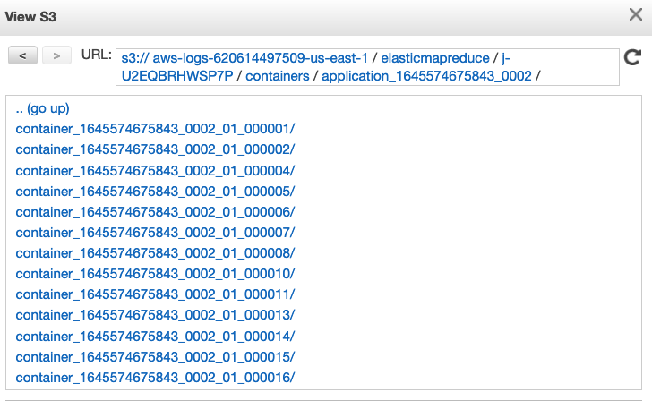

If you have SSH access to the EC2 nodes of your EMR cluster, you can also see application master and executor logs stored in the local disk under /var/log/containers. You will only need to see the local logs if S3 logs are unavailable for some reason. Once the application finishes, the logs are aggregated to HDFS and are available for up to 48 hours based on the property *yarn.log-aggregation.retain-seconds*.

## ** BP 5.1.20 -   Consider Observability Platforms **

Spark JMX metrics will supply you with fine-grained details on resource usage. It goes beyond physical memory allocated and identifies the actual heap usage based on which you can tune your workloads and perform cost optimization. There are several ways to expose these JMX metrics. You can simply use a ConsoleSink which prints the metrics to console where you submit your job or CSVSink to write metrics to a file which you can use for data visualization. But these approaches are not tidy. There are more options as detailed [here](https://spark.apache.org/docs/latest/monitoring.html). You can choose an observability platform based on your requirements. Following are some example native options.

### Amazon Managed Services for Prometheus and Grafana
AWS offers [Amazon Managed Prometheus (AMP)](https://aws.amazon.com/prometheus/) which is a Prometheus-compatible monitoring and alerting service that makes it easy to monitor containerized applications and infrastructure at scale. [Amazon Managed Grafana (AMG)](https://aws.amazon.com/grafana/) is a fully managed service for open source Grafana developed in collaboration with Grafana Labs. Grafana is a popular open source analytics platform that enables you to query, visualize, alert on and understand your metrics no matter where they are stored. You can find the [deployment instructions](https://aws.amazon.com/blogs/big-data/monitor-and-optimize-analytic-workloads-on-amazon-emr-with-prometheus-and-grafana/) available to integrate Amazon EMR with OSS Prometheus and Grafana which can be extended to AMP and AMG as well. Additionally, Spark metrics can be collected using [PrometheusServlet](https://spark.apache.org/docs/latest/monitoring.html) and [prometheus/jmx_exporter](https://github.com/prometheus/jmx_exporter). However, some bootstrapping is necessary for this integration.

###Amazon Opensearch
[Amazon Opensearch](https://aws.amazon.com/blogs/opensource/introducing-opensearch/) is a community-driven open source fork of [Elasticsearch and Kibana](https://aws.amazon.com/blogs/opensource/stepping-up-for-a-truly-open-source-elasticsearch/). It is a popular service for log analytics. Logs can be indexed from S3 or local worker nodes to Amazon Opensearch either using AWS Opensearch SDK or Spark connector. These logs can then be visualized using Kibana To analyze JMX metrics and logs, you will need to develop a custom script for sinking the JMX metrics and importing logs.

Apart from native solutions, you can also use one of the AWS Partner solutions. Some of the popular choices are Splunk, Data Dog and Sumo Logic.

## ** BP 5.1.21  -  Potential Resolution for Common Errors **

1. **S3 503 Slow Down Mitigation**
For mitigating S3 throttling errors, consider increasing *fs.s3.maxRetries* in emrfs-site configuration. By default, it is set to 15 and you may need to increase it based on your workload needs. You can also increase the multipart upload threshold in EMRFS. Default value at which MPU triggers is 128 MB.

```
[{
    "classification": "emrfs-site",
    "properties": {
        "fs.s3.maxRetries": "20",
        "fs.s3n.multipart.uploads.split.size": "268435456"
    },
    "configurations": []
}]
```
Consider using Iceberg format's [ObjectStoreLocationProvider](https://iceberg.apache.org/docs/latest/aws/#object-store-file-layout) to store data under [0*7FFFFF] prefixes and thus, help Amazon S3 learn write pattern to scale accordingly.
```
 CREATE TABLE my_catalog.my_ns.my_table
 ( id bigint,
   data string,
   category string)
   USING iceberg OPTIONS
   ( 'write.object-storage.enabled'=true,
     'write.data.path'='s3://my-table-data-bucket')
     PARTITIONED BY (category);
```
Your S3 files will be arranged under MURMUR3 hash prefixes like below.
```
 2021-11-01 05:39:24  809.4 KiB 7ffbc860/my_ns/my_table/00328-1642-5ce681a7-dfe3-4751-ab10-37d7e58de08a-00015.parquet
 2021-11-01 06:00:10    6.1 MiB 7ffc1730/my_ns/my_table/00460-2631-983d19bf-6c1b-452c-8195-47e450dfad9d-00001.parquet
 2021-11-01 04:33:24    6.1 MiB 7ffeeb4e/my_ns/my_table/00156-781-9dbe3f08-0a1d-4733-bd90-9839a7ceda00-00002.parquet
```
* If using Iceberg is not an option and if above approaches don’t resolve the issue, you can create an AWS support case to partition your S3 prefixes. But the prefix pattern needs to be known in advance for eg: s3://bucket/000-fff/ or s3://bucket/<date fields from 2020-01-20 to 2030-01-20>/

2. **Increase event queue size and heartbeat interval for large number of executors**
    - If the size of “dropped events

3. **Increase HADOOP, YARN and HDFS heap sizes for intensive workflows**

4. **Use spark.yarn.archive to avoid compressing dependencies especially for high concurrency workloads**
